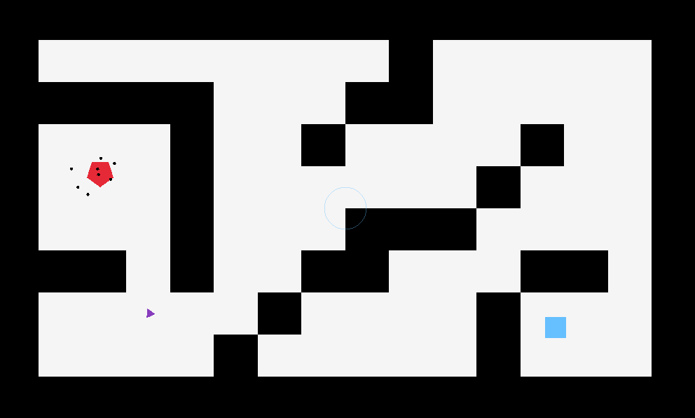

# AI Game
AI demonstration in C++ using Raylib

## Building
The program uses Raylib, and looks for raylib.lib in the raylib projects build directory.
This is to say build the raylib project before running the program.

## Usage
When launching the program, it will attempt to open 'map.txt' to load level geometry, although game objects are created in code. The map is a plane text file, where a 0 is an empty space, and a 1 is a wall. A simple map file is included in Project/AI-Game/.

### How to play
The 'leader' (purple triangle) will move between the player and enemy bases (blue square and red pentagon), bringing 'swarmers' (black dots) to attack the player base.  
By holding the left mouse button, you can damage swarmers around the cursor, causing them to become hollow rings, before being killed.  
Tab can be used to toggle displaying nodes and FPS.

